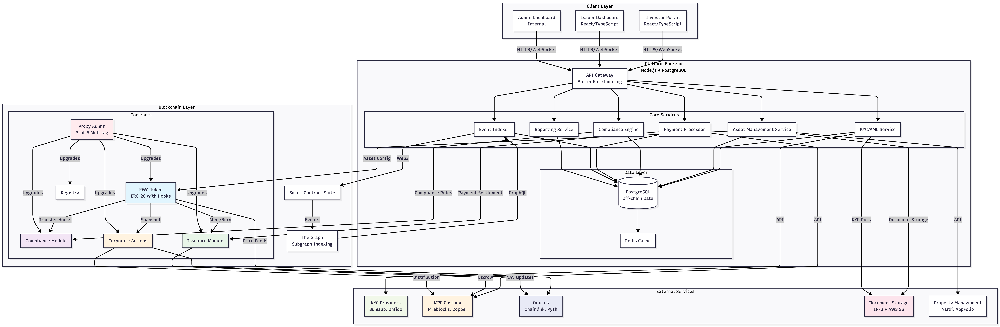

# RWA Platform Architecture Design
*Production-Ready Tokenization Platform for Real-World Assets*

## 1. Executive Summary

This document outlines a secure, compliant, and scalable architecture for tokenizing Real-World Assets (RWAs) including real estate, private credit, and investment funds. The design prioritizes **on-chain compliance enforcement**, **regulatory readiness**, and **operational security** while maintaining blockchain's transparency and efficiency benefits.



### Core Design Principles
1. **Compliance First**: Regulatory requirements embedded in smart contracts
2. **Security by Design**: Defense-in-depth approach at all layers
3. **Practical Upgradeability**: Safe, controlled contract upgrades
4. **Gas Efficiency**: Optimized for production use cases
5. **Clear Boundaries**: Well-defined on-chain vs off-chain responsibilities

## 2. System Architecture Overview

### 2.1 High-Level Component Architecture

The system follows a layered architecture with clear separation of concerns:


### 2.2 Smart Contract Architecture

**Modular Design Philosophy**:
- **Separation of Concerns**: Each contract handles specific functionality
- **Upgradeability**: Proxy pattern for critical components
- **Gas Efficiency**: Minimal dependencies in hot paths
- **Security**: Role-based access control throughout

**Contract Relationships**:
```text
                  ┌──────────────────┐
                  │   Proxy Admin    │
                  │ (3-of-5 Multisig)│
                  └─────────┬────────┘
                            │
                  ┌─────────▼────────┐
                  │    RWA Token     │
                  │   (Proxy to      │
                  │   Implementation)│
                  └─────────┬────────┘
             ┌──────────────┼──────────────┐
      ┌──────▼──────┐ ┌─────▼─────┐ ┌─────▼──────┐
      │ Compliance  │ │ Registry  │ │  Issuance  │
      │   Module    │ │           │ │   Module   │
      │  (v1.0.0)   │ │ (v1.0.0)  │ │  (v1.0.0)  │
      └─────────────┘ └───────────┘ └────────────┘
             │              │              │
      ┌──────▼──────┐ ┌─────▼─────┐ ┌─────▼──────┐
      │  Corporate  │ │ Treasury  │ │   Escrow   │
      │   Actions   │ │  Module   │ │  Contracts │
      │  (v1.0.0)   │ │ (v1.0.0)  │ │  (v1.0.0)  │
      └─────────────┘ └───────────┘ └────────────┘
```

## 3. Core Design Decisions

### 3.1 Token Standard Selection: ERC-20 with Compliance Hooks

**Choice**: Modified ERC-20 standard with transfer hooks (inspired by ERC-1400/ERC-3643)

**Evaluation of Alternatives**:
- **ERC-20**: ✅ Fractional ownership, widely supported, with compliance hooks
- **ERC-1155**: ❌ Overly complex for fungible assets, poor wallet support
- **ERC-721**: ❌ Non-fungible, not suitable for fractional ownership
- **ERC-1400**: ✅ Good for compliance but less adoption

**Implementation Approach**:
```solidity
contract RWAToken is ERC20 {
    // Transfer hook for compliance checks
    function _beforeTokenTransfer(
        address from,
        address to,
        uint256 amount
    ) internal override {
        // Call compliance module
        require(
            compliance.validateTransfer(from, to, amount),
            "Compliance check failed"
        );
    }
}

```

### 3.2 Compliance Enforcement
- **On-chain enforcement**: Transfer hooks validate every transaction
- **Allowlist-based**: Only KYC'd investors can hold tokens
- **Jurisdiction rules**: Encoded country restrictions
- **Admin controls**: Pause, freeze, forced transfer capabilities

### 3.3 Security Model
- **Multi-signature admin**: 3-of-5 for contract upgrades
- **Time-locked upgrades**: 7-day delay for critical changes
- **Emergency pause**: Global pause capability
- **Regular audits**: Quarterly security assessments

## 4. Key Components

### 4.1 Smart Contracts
1. **RWA Token**: ERC-20 with transfer hooks
2. **Compliance Module**: Allowlist and rule enforcement
3. **Issuance Module**: Primary market sales
4. **Corporate Actions**: Dividends and redemptions
5. **Registry**: Asset and investor management

### 4.2 Off-chain Services
1. **KYC/AML Service**: Investor verification
2. **Asset Management**: Asset onboarding and monitoring
3. **Payment Processor**: USDC/fiat handling
4. **Event Indexer**: Blockchain event processing
5. **Reporting Service**: Regulatory reporting

## 5. Key User Flows

### 5.1 Asset Issuance
Issuer → Due diligence → Token deployment → Primary offering

### 5.2 Investor Onboarding
Investor → KYC → Allowlisting → Purchase → Token receipt

### 5.3 Secondary Trading
Seller → Listing → Compliance check → Transfer → Settlement

### 5.4 Dividend Distribution
Issuer → Fund pool → Snapshot → Claim period → Distribution

### 5.5 Redemption
Asset sale → Valuation → Redemption window → Token burn → Payout

## 6. Security Considerations

### 6.1 Smart Contract Security
- Multiple independent audits
- Formal verification for critical invariants
- Bug bounty program ($1M+)
- Time-locked upgrades

### 6.2 Key Management
- MPC custody for issuer funds
- Multi-signature for admin functions
- Hardware wallet storage
- Regular key rotation

### 6.3 Operational Security
- No PII on-chain
- Encrypted off-chain storage
- Regular penetration testing
- Incident response plan

### 6.4 Threat Model

| Threat Vector | Likelihood | Impact | Mitigation |
| --- | --- | --- | --- |
| Smart Contract Exploit | Low | Critical | Multiple audits, formal verification |
| Admin Key Compromise | Medium | Critical | Multisig, timelocks, emergency pause |
| Compliance Bypass | Medium | High | On-chain enforcement, monitoring |
| Oracle Manipulation | Low | High | Multiple oracles, manual override |
| Front-end Attack | High | Medium | CSP, transaction simulation |
| Data Breach | Medium | High | No PII on-chain, encryption |

### 6.5 Access Control Hierarchy

Roles and Permissions:

```text

Platform Admin (Multisig)
    ├── Contract upgrades (with timelock)
    ├── Emergency pause/unpause
    └── Treasury management

Compliance Officer
    ├── Allowlist management
    ├── Freeze/unfreeze addresses
    └── Rule configuration

Issuer (per asset)
    ├── Mint tokens (within limits)
    ├── Initiate corporate actions
    └── Update asset metadata

Asset Manager
    ├── Distribute dividends
    ├── Process redemptions
    └── Update NAV/valuations

Investor
    ├── Transfer tokens (with compliance)
    ├── Claim dividends
    └── Redeem tokens
```

## 7. Compliance Framework

### 7.1 On-chain Enforcement
- Transfer restrictions at contract level
- Allowlist validation before any transfer
- Jurisdiction encoding and validation
- Administrative override for regulators

### 7.2 Off-chain Verification
- KYC/AML via accredited providers
- Accreditation verification
- Sanctions screening
- Ongoing monitoring

### 7.3 Compliance Rule Engine

### Rule Types:

1.  Allowlist Rules: Address must be in allowlist

2.  Jurisdiction Rules: Sender/recipient jurisdiction compatibility

3.  Investor Type Rules: Retail vs accredited restrictions

4.  Transfer Limit Rules: Daily/weekly volume limits

5.  Time Lock Rules: Holding period requirements

### Rule Evaluation:

```text

Transfer Request
    ↓
Check Allowlist Status
    ↓
Check Jurisdiction Compatibility
    ↓
Check Investor Type Compatibility
    ↓
Check Transfer Limits
    ↓
Check Time Locks
    ↓
Approve/Reject

```

## 8. Assumptions & Constraints

### Assumptions
1. Ethereum mainnet deployment
2. US accredited investors initially
3. Real estate primary asset class
4. Platform as regulated transfer agent

### Constraints
1. No PII on-chain
2. Gas costs must be reasonable
3. Modular, not monolithic contracts
4. Feasible for small team implementation

## 9. Roadmap

### Phase 1 (Months 1-3)
- Single asset type (real estate)
- Basic compliance rules
- Manual corporate actions
- US jurisdiction only

### Phase 2 (Months 4-6)
- Multiple asset types
- Automated corporate actions
- Global jurisdiction support
- L2 integration

### Phase 3 (Months 7-9)
- Advanced compliance engine
- Institutional features
- DAO governance transition
- Multi-chain deployment

## 10. Conclusion
This architecture provides a secure, compliant, and scalable foundation for RWA tokenization, balancing blockchain innovation with regulatory requirements through on-chain enforcement and off-chain verification.

